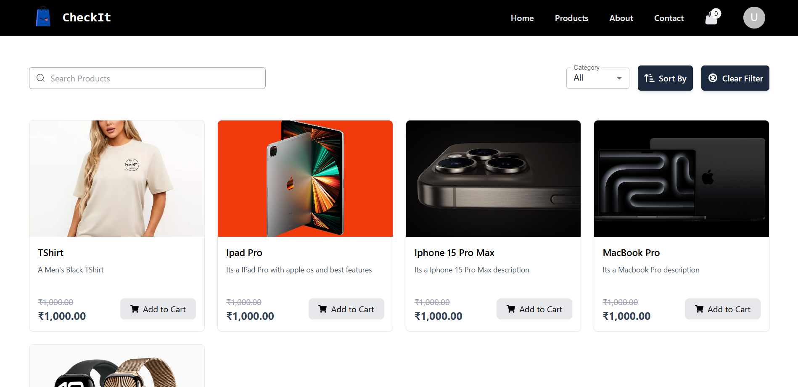
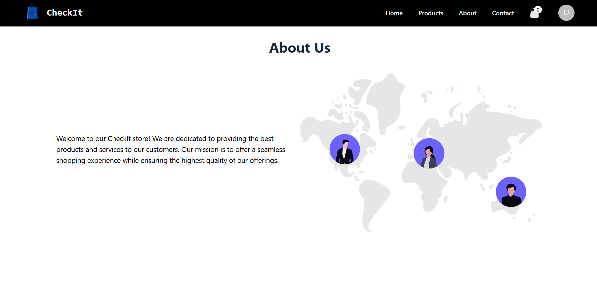
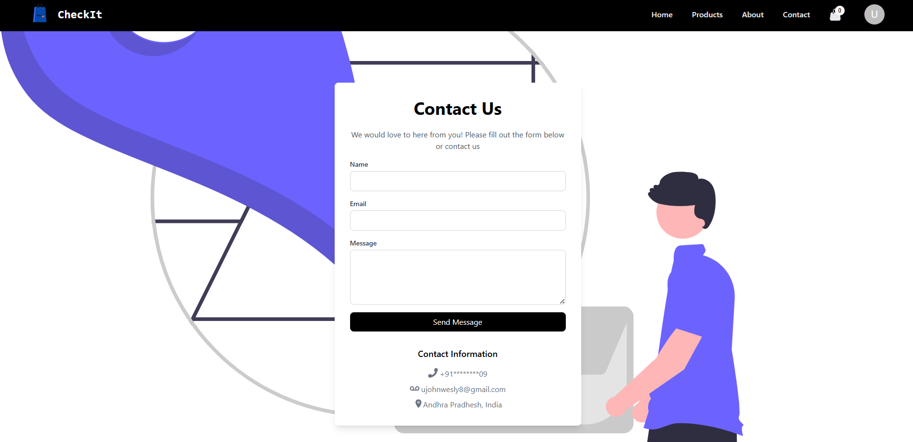
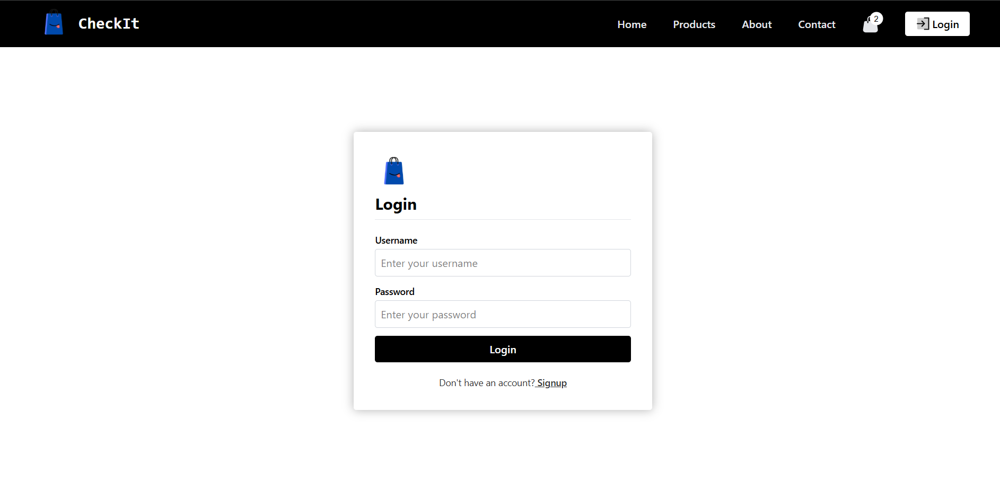

# 🛒 CheckIt – E-Commerce Website

CheckIt is a full-stack e-commerce application built with **React** (frontend) and **Spring Boot** (backend). It provides users with a smooth shopping experience and admin control over products, orders, and users. The app is containerized with **Docker** and deployed using **Render** and **Neon.tech** for scalable production hosting.

---
## 📸 Screenshots

## 🚀 Tech Stack

### 🖥 Frontend
- **React.js**
- **Redux Toolkit**
- **Tailwind CSS / Framer Motion** (optional for animations/UI)

### ⚙️ Backend
- **Java 17**
- **Spring Boot**
- **Spring Security & JWT**
- **JPA + Hibernate**

### 🛢 Database
- **PostgreSQL (hosted on [Neon.tech](https://neon.tech))**

### 🐳 DevOps & Deployment
- **Docker (multi-container setup)**
- **Render (for backend hosting)**
- **Netlify / Vercel / Render (for frontend hosting)**

---

## ✨ Features

### 👤 User
- User registration & login with JWT authentication
- Browse products by categories
- Product detail page
- Add to cart / remove from cart
- Checkout and order history

### 🛠 Admin
- Dashboard with product & order overview
- Create / Update / Delete products
- Manage user accounts
- Order fulfillment management

---

## 📦 Folder Structure (Simplified)
<pre> CheckIt/
├── backend/                         # Spring Boot backend
│   ├── src/
│   │   ├── main/
│   │   │   ├── java/com/checkit/   # Java source files
│   │   │   │   ├── controller/
│   │   │   │   ├── service/
│   │   │   │   ├── model/
│   │   │   │   ├── repository/
│   │   │   │   └── config/
│   │   │   └── resources/
│   │   │       ├── application.properties
│   │   │       └── static/
│   └── Dockerfile                  # Backend Dockerfile
│
├── frontend/                        # React frontend
│   ├── public/
│   ├── src/
│   │   ├── components/
│   │   ├── pages/
│   │   ├── redux/
│   │   ├── services/
│   │   └── App.jsx
│   ├── tailwind.config.js
│   ├── index.html               # Frontend          </pre>