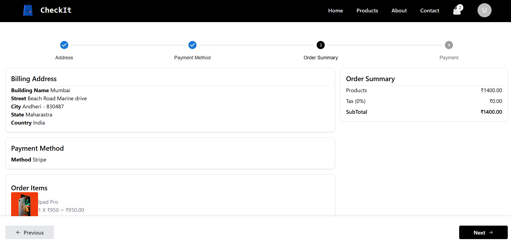
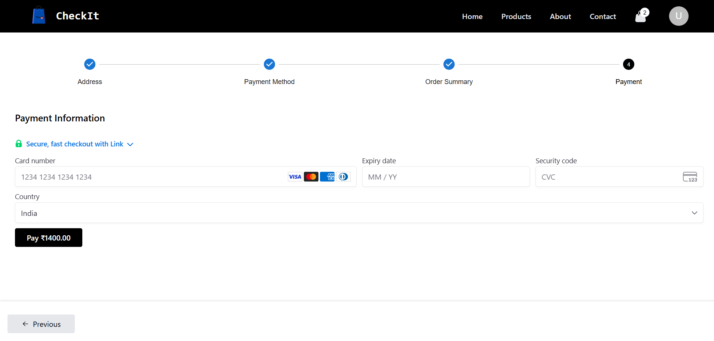
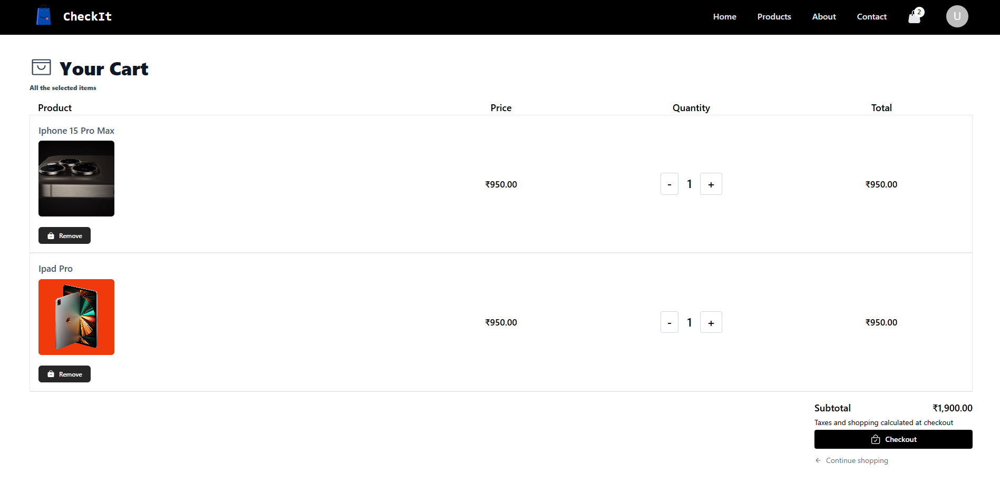

# 🛒 CheckIt – Modern E-Commerce Platform

CheckIt is a robust, full-stack e-commerce platform designed for seamless online shopping and efficient store management. Built with **React** for the frontend and **Spring Boot** for the backend, CheckIt delivers a fast, responsive, and secure experience for both users and administrators. The project now features **Stripe payment integration** for secure and reliable user transactions.

Key highlights:
- 🛍️ Beautiful, responsive UI with Tailwind CSS
- 🔒 Secure authentication and authorization
- ⚡ Lightning-fast product browsing and search
- 💳 **Stripe payments** for real-world checkout
- 🛠️ Powerful admin dashboard for product, order, and user management
- 🚀 Containerized with Docker and deployed on scalable cloud platforms

---
## 📸 Screenshots

</img>
</img>

## 🚀 Tech Stack

### 🖥 Frontend
- **React.js**
- **Redux Toolkit**
- **Tailwind CSS**
- **Framer Motion** (optional for animations/UI)
- **Stripe.js & React Stripe.js** (for payments)

### ⚙️ Backend
- **Java 17**
- **Spring Boot**
- **Spring Security & JWT**
- **JPA + Hibernate**
- **Stripe API integration**

### 🛢 Database
- **PostgreSQL (hosted on [Neon.tech](https://neon.tech))**

### 🐳 DevOps & Deployment
- **Docker (multi-container setup)**
- **Render (for backend hosting)**
- **Netlify / Vercel / Render (for frontend hosting)**

---

## ✨ Features

### 👤 User
- User registration & login with JWT authentication
- Browse products by categories
- Product detail page
- Add to cart / remove from cart
- **Stripe-powered checkout for secure payments**
- Order history and receipts

### 🛠 Admin
- Dashboard with product & order overview
- Create / Update / Delete products
- Manage user accounts
- Order fulfillment management
- View payment status and transaction history

---

---

## 💳 Stripe Payment Integration

CheckIt now supports real payments using Stripe! Users can securely pay for their orders with credit/debit cards. The integration uses the latest Stripe.js and React Stripe.js libraries for a smooth, PCI-compliant checkout experience. All payment data is handled securely via Stripe’s APIs.

---

## 📦 Folder Structure (Simplified)
<pre> CheckIt/
├── backend/                         # Spring Boot backend
│   ├── src/
│   │   ├── main/
│   │   │   ├── java/com/checkit/   # Java source files
│   │   │   │   ├── controller/
│   │   │   │   ├── service/
│   │   │   │   ├── model/
│   │   │   │   ├── repository/
│   │   │   │   └── config/
│   │   │   └── resources/
│   │   │       ├── application.properties
│   │   │       └── static/
│   └── Dockerfile                  # Backend Dockerfile
│
├── frontend/                        # React frontend
│   ├── public/
│   ├── src/
│   │   ├── components/
│   │   ├── pages/
│   │   ├── redux/
│   │   ├── services/
│   │   └── App.jsx
│   ├── tailwind.config.js
│   ├── index.html               # Frontend          </pre>